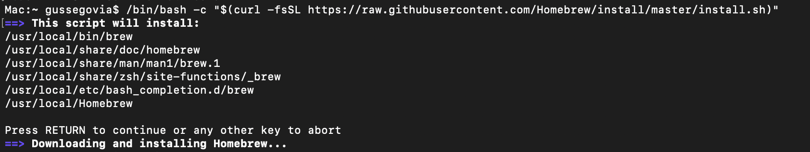

 # SFML Setup within CLion

## Understanding how CLion Handles Compilation & Execution

If you have ever wrote a simple "Hello World!" program within CLion, you would know that you are able to compile and run your code with a single click of the run button. The reason why you are able to have that streamlined experience is due to CLion's use of a framework called CMake within their project creation templates. The reason why CLion is able to maintain that single-click run experience even when multiple files are made is due to the fact that it automatically integrates it into your CMakeLists.txt file. What the CMakeLists.txt file does is 

## Static Libraries in CLion


# SFML


## Installation
Open terminal and type copy the following.
```
/bin/bash -c "$(curl -fsSL https://raw.githubusercontent.com/Homebrew/install/master/install.sh)"
```
This is instaling homebrew which is an open-source software package management system that simplifies the installation of software.



```
brew install sfml
```
This installs sfml through homebrew

### Windows


### MacOS


## Setup

### MacOS
Once installation is done, in your Minesweeper project, copy and paste this into your CMakeLists.txt file:
```
cmake_minimum_required(VERSION 3.2)
set(CMAKE_CXX_STANDARD 11)
set(CMAKE_CXX_STANDARD_REQUIRED ON)

project(<your project name here>)

## If you want to link SFML statically
# set(SFML_STATIC_LIBRARIES TRUE)

## In most cases better set in the CMake cache
# set(SFML_DIR "<sfml root prefix>/lib/cmake/SFML")

find_package(SFML 2.5 COMPONENTS graphics audio REQUIRED)
add_executable(Minesweeper main.cpp)
target_link_libraries(Minesweeper sfml-graphics sfml-audio)
```

And replace the < your project name here > in  the "project(< your project name here >)" part with the name of the project you made in CLion. The gator brackets shouldn't be there. It should look like project(Minesweeper).

### Windows


